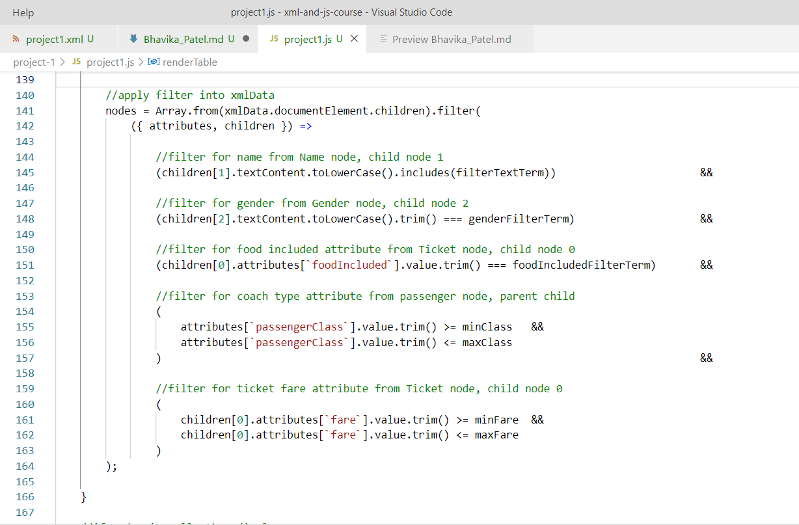
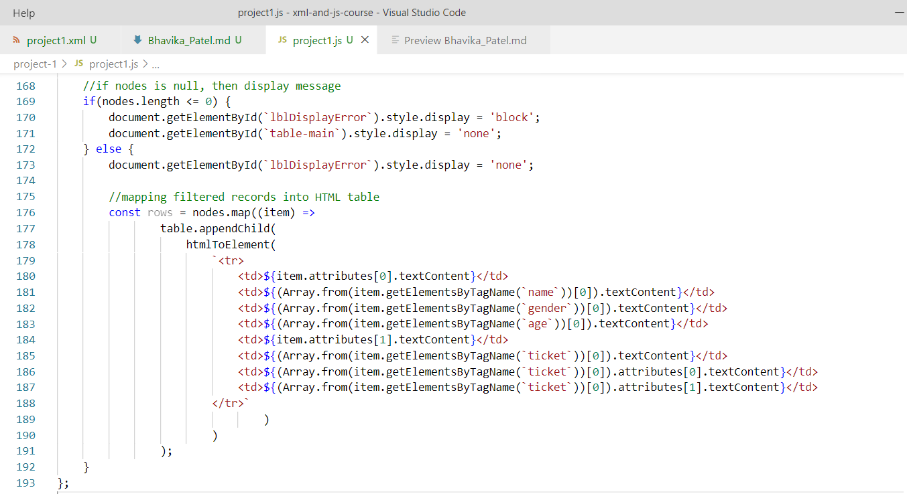
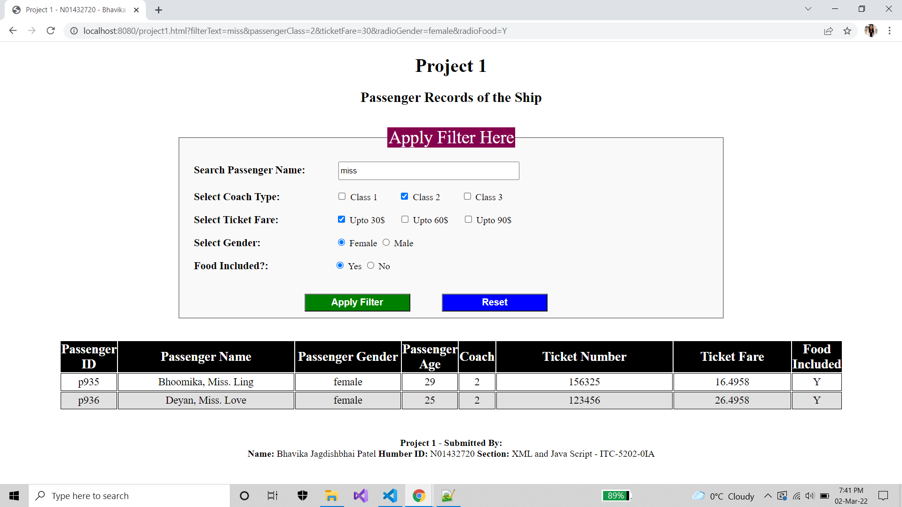

# **Project - 1**
## **Member 1:**
 - Name: Bhavika Jagdishbhai Patel
 - Humber ID: N01432720
 - Section: XML and Java Script - ITC-5202-0IA
#
## **Contribution from my side in Project 1:**
    - I created project1.html, project1.js and project1.css file

    - In "project1.html" file:
        - I created a html page with textbox, radio button, checkbox, submit and reset button, html table, label for displaying message/error if any
        - Applied styling for each html component using external css file(project1.css) into HTML page
        - Applied external javascript (project1.js) into HTML page

    - In "project1.js" file:
        - The below listed function implemented by me to perform specific operation into HTML file:
        - function htmlToElement() for creating document for HTML
        - function loadData() for loading XML data into HTML table
        - called loadData() in which I passed XML file (project1.xml)
                - Ex: loadData(`http://localhost:8080/project1.xml`, renderTable);

        - function renderTable() for rendering records of XML into HTML table
            - retreive filters from URL, using "window.location.search"
            - If there are filters present in URL, then applied filters into XML data and render into HTML table
                - Displayed filter text into textbox
                - Checked checkbox which value found from URL
                - Selected radio button which value found from URL
            - If no filters in URL, then display all records of XML data and render into HTML table
            - Applied filters on XML data using filter() method
                - For filter on checkbox, 
                    - I used getAll() for retrieving multiple parameters which passed in URL by checking multiple checkboxes of filteration
                    - I checked min and max value for each passenger coach and ticket fare checked checkbox
                    - I used Math.max() and min() function for getting maximum and minimum values from an array
                    - I used spread operator(...) for specifying an array in min() and max()
                - For filter on radio button,
                    - I compare value using "===" operator withing specified node 
                    - This filter applied in each radio button selected for gender as well as food included
                - For filter on textbox,
                    - I check word/character/text using includes() in passenger's name
                - In that, I applied filters on records on parent as well as child nodes and its attributes, as required
#### **Filter records on XMLData using filter():**
#

#
            - Mapping filtered records into HTML table by its tag Name and expected attributes by its attribute's index
#### **Mapping filtered XMLData using map():**
#

#
            - function onReset() for resetting values of HTML components as well as filter values from URL
            - passed this onReset() into HTML form's onreset event
#

#### **Output:**
#

#
- Please refer project1.html, project1.js and project1.css file in my repo