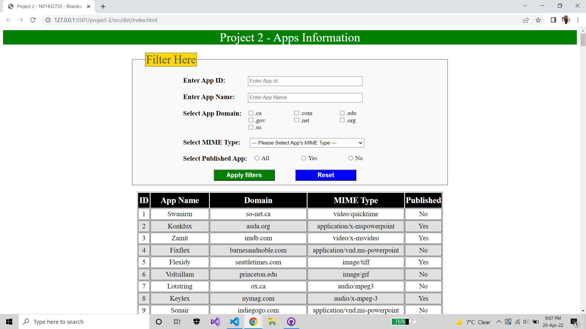

# **Project - 2**
## **Submitted By:**
 - Name: Bhavika Jagdishbhai Patel
 - Humber ID: N01432720
 - Section: XML and Java Script - ITC-5202-0IA
 - Project 2 : Apps Information
#
## **Tasks I have implemented in Project 2:**
    - I created index.html, index.css, apps.js, main.js file
    - Displaying Application's information such as AppID, App Name, its MIME Type, Domain and app's status(Published or not)
    - External javascript created as bundle.js in dist folder

    - In "index.html" file:
        - I created a html page with textbox, radio button, checkbox, dropdown, submit and reset button, html table, 
          label for displaying message/error if any
        - Applied styling for each html component using external css file(index.css) into HTML page
        - Applied external javascript (bundle.js) into HTML page

    - In "main.js" file:
        - The below listed function implemented by me to perform specific operation into HTML file:
        - Passed JSON file as a data using require()

        - function renderTable() for rendering JSON data into HTML table

        - function renderAppDomainCheckBox() for rendering dynamic checkbox of domain from the JSON data
            - Retrieve unique domain name and display it into check box (retrieving .com, .net, and so on)
            - For retrieving unique domain name, 
                - I first retreive domain name
                - Split domain from "."
                - Use Set object and spread operator for retrieving unique domain from JSON array
            - Bind checkbox into HTML

        - function renderPublishedRadioBox() for rendering dynamic radio button of App's publication status from the JSON data

        - function renderMimeTypeDropDown() for rendering dynamic dropdown of MIME Type of App from the JSON data

        - call all above listed functions in getAll()

        - Submit event of window: OnSubmit():
            - gets entered or selected values of the HTML controls
            - using event.target."tmlControlName".value
            - for retrieving selected checkbox,
                - First retrieve all checkbox's value as an array using spread operator
                - I used flatMap() to flat the array, and retrieve selected checkbox's value 
                - When user selects nothing then I passed ""
            - pass all the filters in getAll() and render the HTML table

        - Reset event of window: OnReset():
            - simply call getAll() without applying any filter

    - In "apps.js" file:
        - There are two methods getAll() and getById()
        - Used require() to pass the JSON data
        - Applied filters in getAll() within a Promise
        - In the domain filter, I used sort(), for sorting retrieved records by AppID

- Please refer index.html, index.css, apps.js, main.js file in project-2/src folder in my repo

#### **Output:**
#

#