# **Assignment 1**

## 1. Open `week-2/assignments/assignment.xml` in your browser. Are there any errors? Explain the error and fix it.
## Answer:
    -> When I opened `week-2/assignments/assignment.xml` in my browser, there is an error on 
 ### -> **line 11 at column 18: Specification mandates value for attribute Date**

    -> This is the parse error caused by invalid tag specification in XML file
    -> XML file does not accept space between within a tag
    -> I fixed this error by removing the space from <effective Date> to <effectiveDate> 

#
## 2. What is the use of CDATA block in this document?
## Answer:
    -> CDATA is XML Character Data
    -> CDATA is block of texts, characters and symbols which are not parsed by XML document
    -> Using CDATA we can embedded character and symbols and run it as a markup.
    -> Example:
        <message>
            <![CDATA[
               Welcome, Bhavika!!!!
            ]]>
        </message>

### **-> CDATA in xml file:**
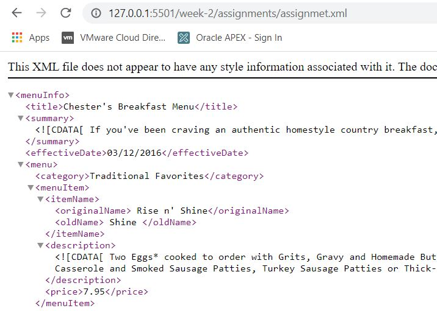  
#   
## 3. Add comment line to the end of file which contains you name and student id.
## Answer:
### **-> assignment.xml:**
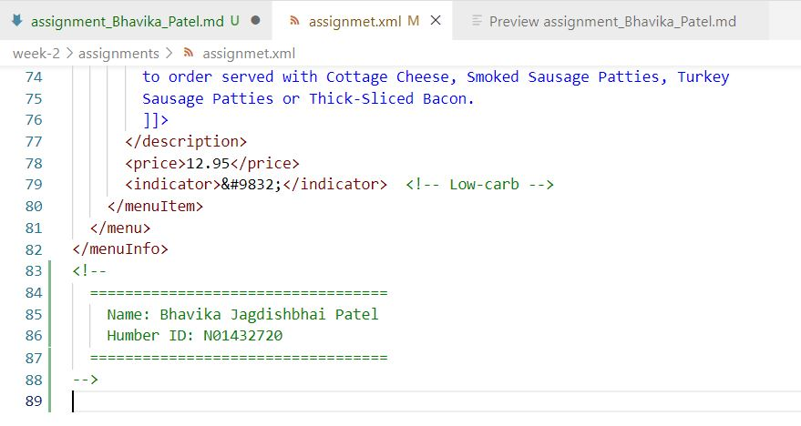 

###   **-> assignment.xml in browser:**
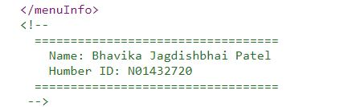 
#
## 4. Identify prolog, document body, and epilog in the document. Are there any processing instructions?
## Answer:
### **-> prolog**
    -> prolog is the beginning part of the XML document.
    -> It indicates that the program written in XML and provides the instructions how to interpret this program
    -> It contains information of 
        • XML declaration
        • Processing instructions
        • Comments lines
        • Document type declaration (DTD)

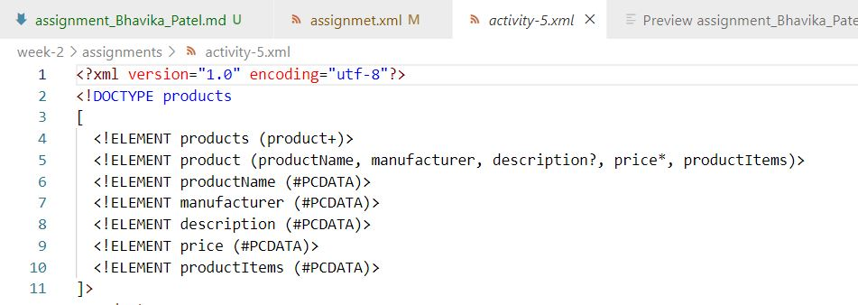 

###   **-> document body**
    -> document body contains XML file's content in a hierarchy tree structure.

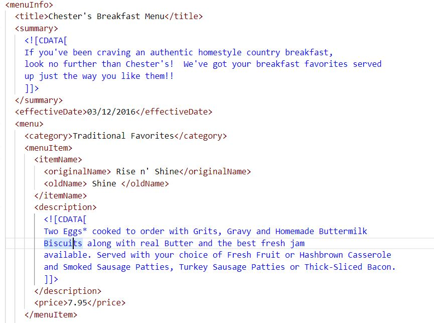 

###   **-> epilog**
    -> epilog contains any final comments or processing instructions of XML files
    -> It is optional
#
## 5. Add inline DTD for this document.
## Answer:
### **-> inline DTD:**
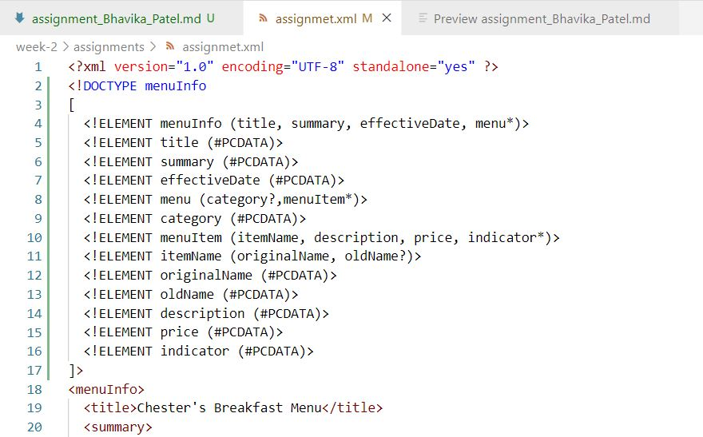 
#
## 6. Verify that file is well-formed and valid.
## Answer:
    -> I uploaded updated XML file with DTD to the https://www.xmlvalidation.com/
    -> Here is the result of that uploaded file.
### **-> Uploaded XML:**
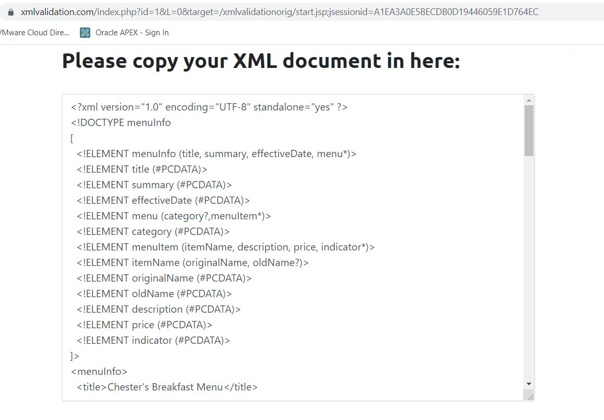 

###   **-> Validated XML:**
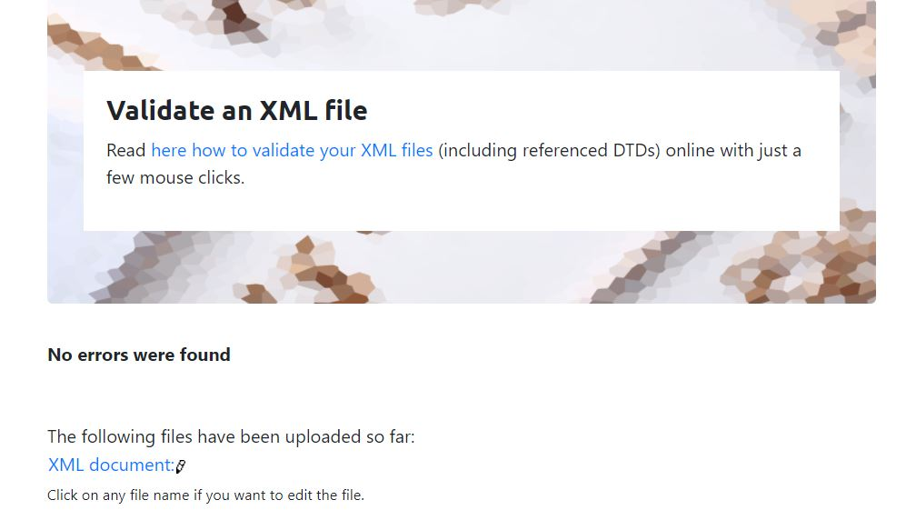 
#
## 7. Create `style.css` file and link it to the file. Add the following styles to the .css:
##    - Change font-size of `originalName`
##    - Display each `category` on the new line
##    - Add any other css-rule
## Answer:
    -> I created style_Bhavika_Patel.css under week-2/assignments
    -> I Applied style_Bhavika_Patel.css into assignment.xml file
    -> All screenshot attached below

### **-> assignment.xml:**
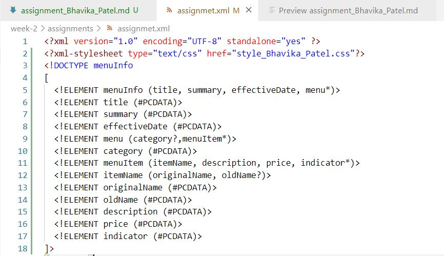

###  **-> style_Bhavika_Patel.css:**
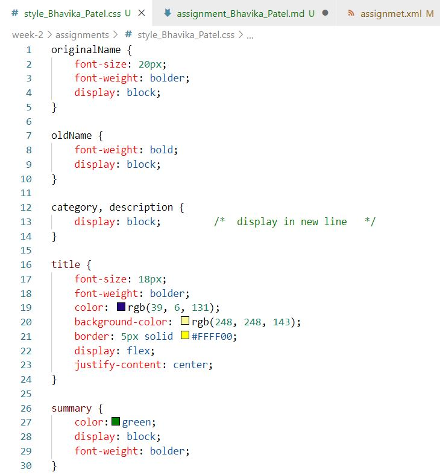

###  **-> assignment.xml file after applying style_Bhavika_Patel.css**
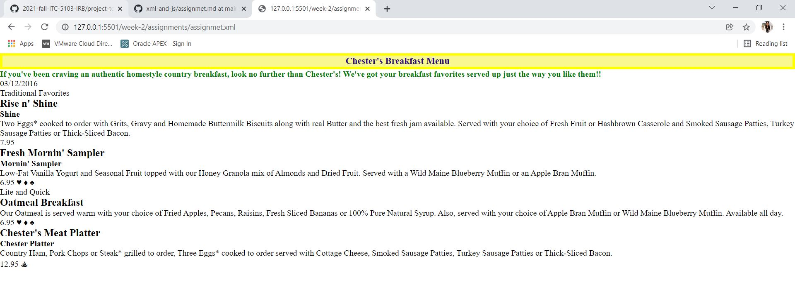
#