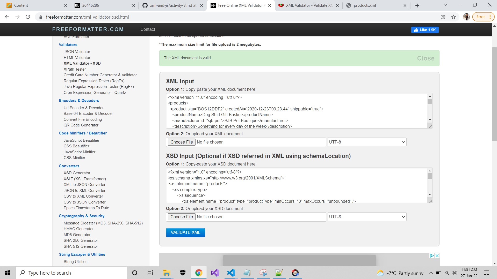

# Activity 3

1. Create XSD for `week-3/products.xml` and save file as `week-3/assignments/activity-3.xsd`
    ### **Answer:** Please refer **activity-3.xsd** file
    #
2. Validate it using [https://www.freeformatter.com/xml-validator-xsd.html](https://www.freeformatter.com/xml-validator-xsd.html) and take a screenshot of validation results
    ### **Answer: activity-3.jpg**
    #
    
