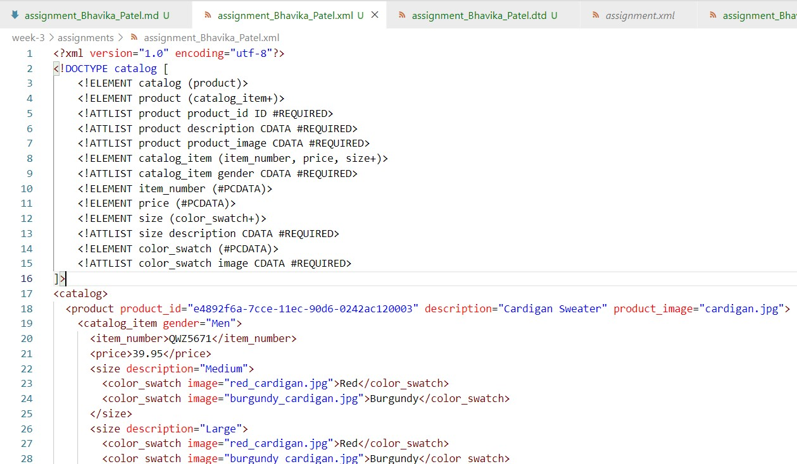
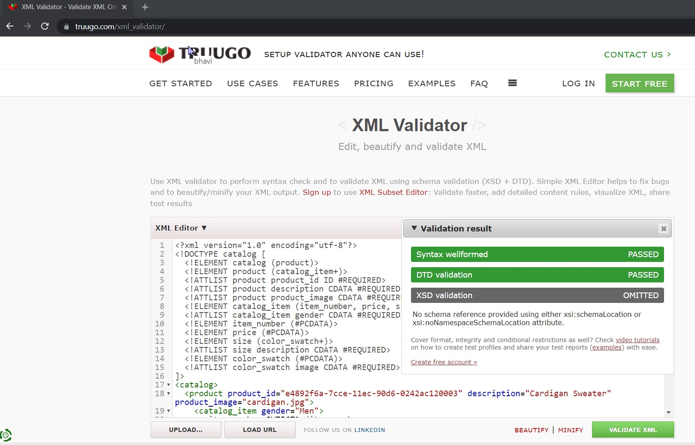
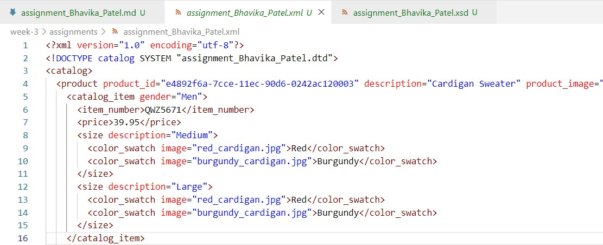
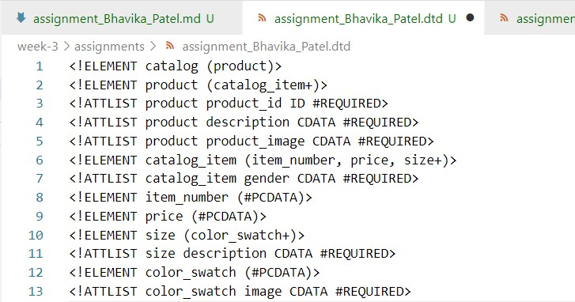
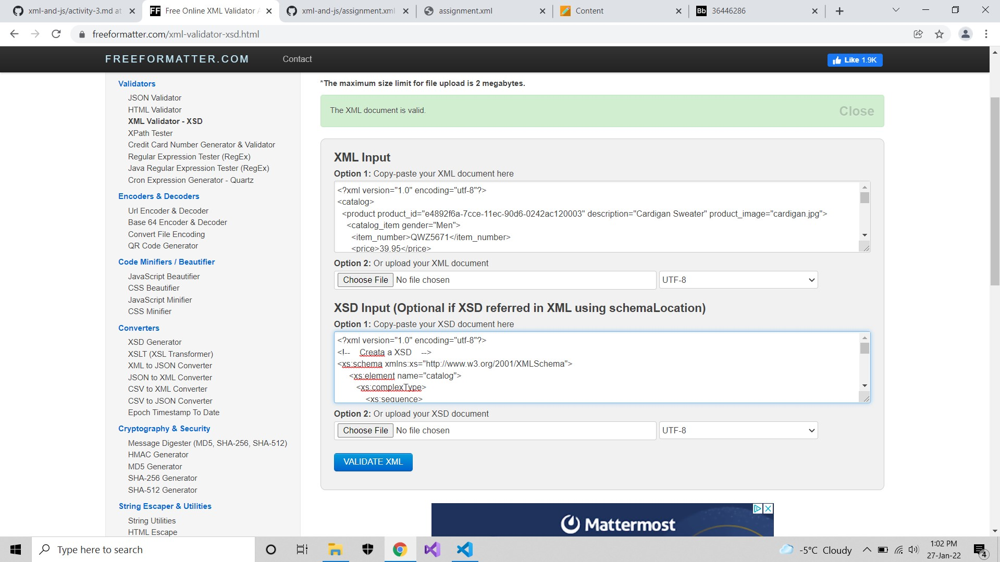
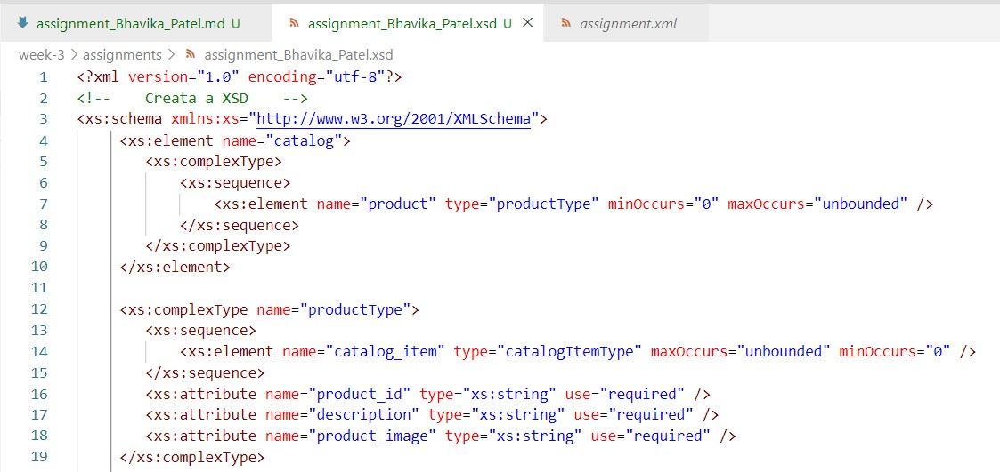

# **Assignment**

## 1. Open `week-3/assignments/assignment.xml` in your editor
## Answer:
### -> create and open **assignment_Bhavika_Patel.xml** file in my editor:
### -> Please refer **assignment__Bhavika_Patel.xml** file
#
  
#  
## 2. Create DTD for this file and validate it using any of the tools we used
## Answer:
### -> Please refer **assignment_Bhavika_Patel.xml and assignment_Bhavika_Patel.dtd**
## **Validation SS:**
 
#
## **assignment_Bhavika_Patel.xml: (using External DTD file)**
#
  
# 
### **assignment_Bhavika_Patel.dtd:**
#
  
# 
## 3. Create XSD for this file and validate it using any of the tools we used
## Answer:
### -> Please refer **assignment_Bhavika_Patel.xsd**
## **Validation SS:**
 
#
### **assignment_Bhavika_Patel.xsd:**
#
  
#  
## 4. Explain your thought process for these 2 declarations
## Answer:
## **DTD: Document Type Definition**
## **XSD: XML Schema Definition**
    -> The DTD derived from SGML syntax however XSD written in XML format.
    -> XSD supports datatypes for elements and attributes which is not flexible in DTD.
    -> XSD is extensible and supports namespace which is not in DTD.
    -> In conclusion, XSD is conveniet for read and understand the schema, on contrary it is complex to create as compared to DTD file. 
# 