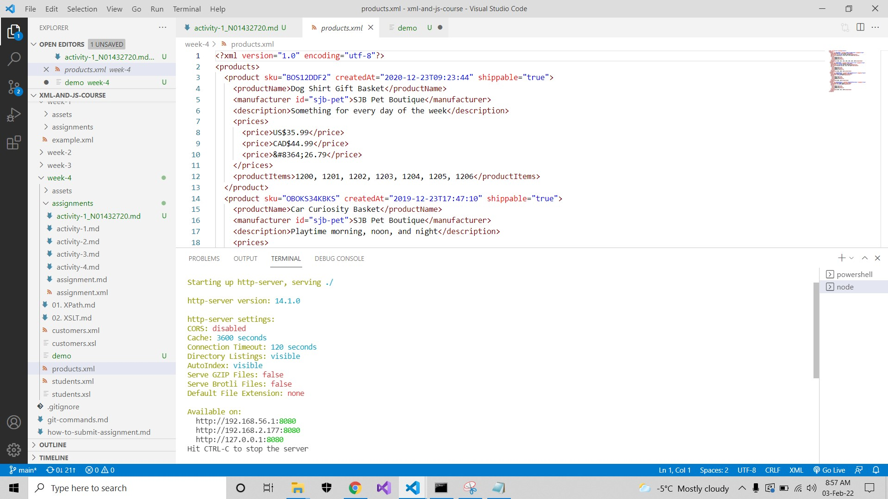
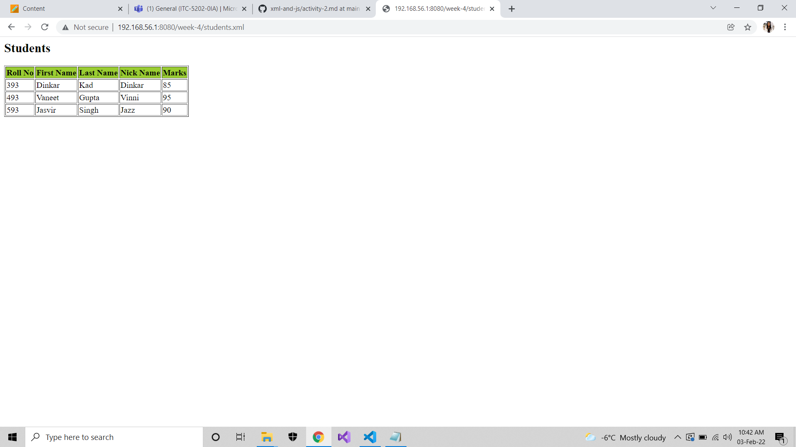

# Activity 2

### 1. Run local server by running `http-server` command in your terminal
    -> Run this command in terminal
            http-server
#
### 2. Take a screenshot of your terminal with running local server and save as `week-4/assignments/activity-2-server.png`
### -> Please refer **activity-2-server.png**
#

#
3. Open `week-4/students.xml` file in browser. Your localhost should be available on `localhost:8080`, `http://127.0.0.1:8080`, `http://192.168.0.16:8080`
#
    -> I access this server : http://192.168.56.1:8080/
#
4. Take a screenshot of your browser with the output of `students.xml` and save as `week-4/assignments/activity-2-output.png`
### -> Please refer **activity-2-output.png**
#

#