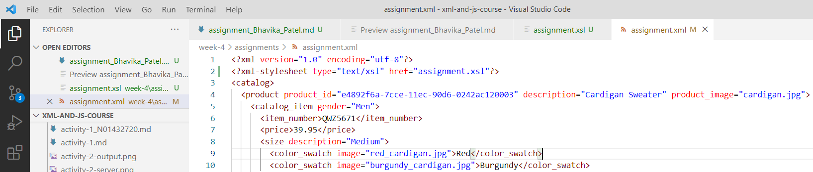
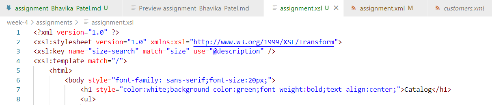
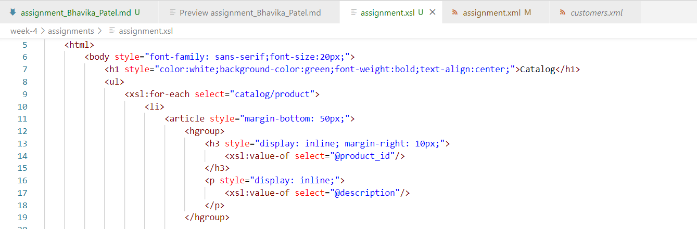
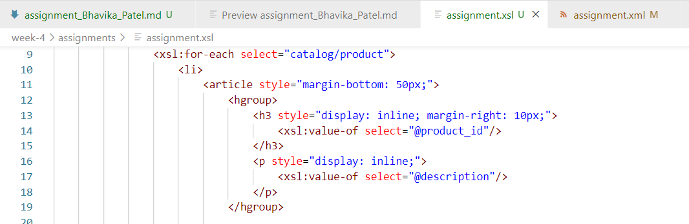
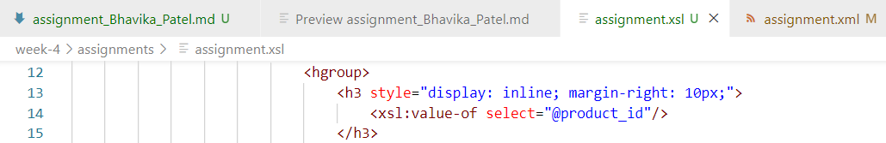
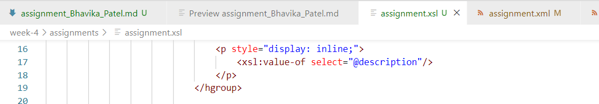
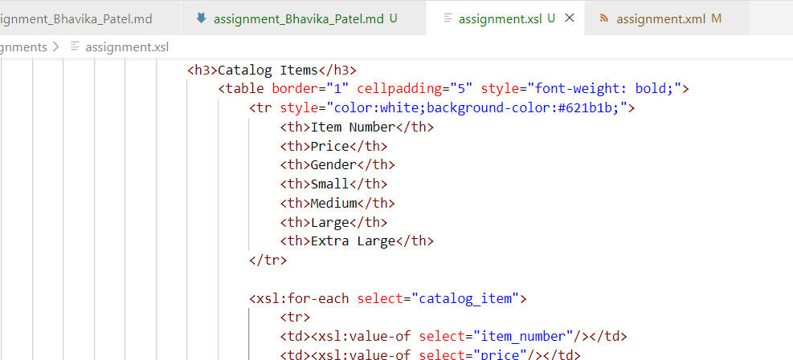
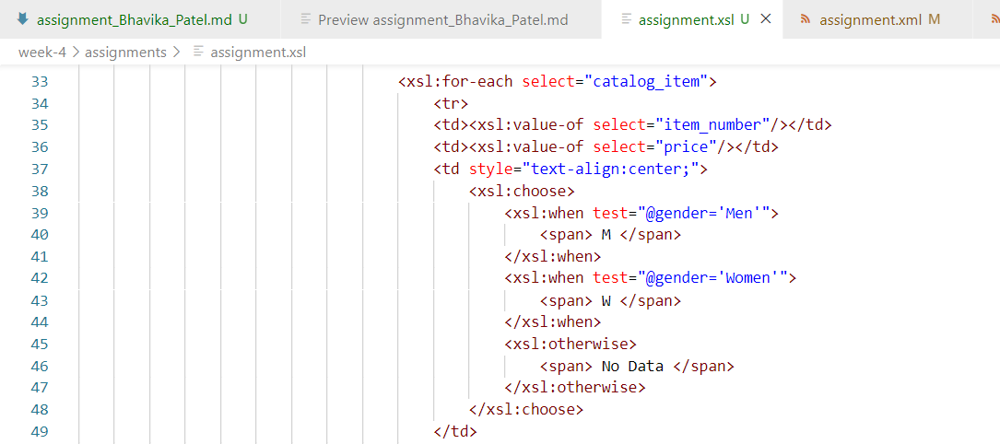
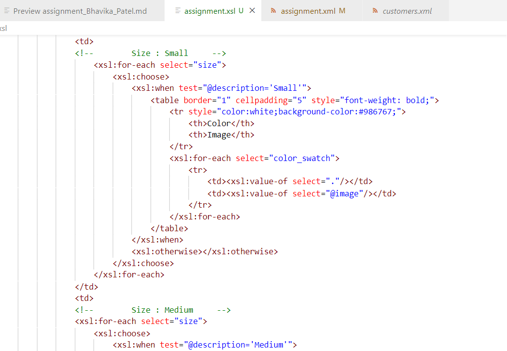

# Assignment

### 1. Open `week-4/assignments/assignment.xml` in your editor
#
### 2. Create xsl file and add link to it
### **Answer:**
###     -> Please refer **assignment.xsl** file in `week-4/assignments/assignment.xsl`
#
### **assignment.xml:**

#
### 3. Display catalog in the following way

### **assignment1_1.png:**
    - main title is "Catalog"

#

### **assignment1_2.png:**
    - use html list tag to display catalog

#

### **assignment1_3.png:**
    - render each item as `<article>` inside list item tag

#

### **assignment1_4.png:**    
    - display product id as h3

#

### **assignment1_5.png:**
    - display product description as paragraph

#

### **assignment1_6.png:**
    - render table of cataaalog items with columns: item number, price, gender, small, medium, large, extra large (if column item is not present in item, then display empty cell)

#

### **assignment1_7.png:**
    - for gender column render M for Men, W for Women

#

### **assignment1_8.png:**
    - inside size columns (small, medium, large, and extra large) display subtable with 2 columns: color and image

#

## **Output:**
### **assignment_output.png:**
#

#
#
### 
    -> Creating a XSL file is quite interesting for formatting XML file and styling its tags,
       However, the process is quite tedious and complicated in terms of syntax and its nodes which I used for dor-each loop.
       This practice of creating XSL file is always knowledgeable.